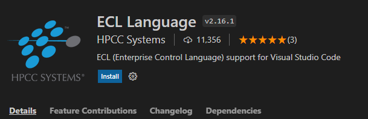
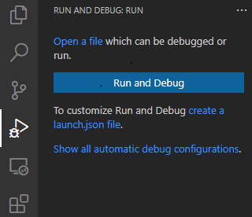
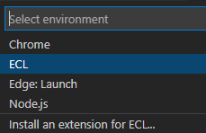

# HSQL (HPCC Systems Structured Query Language)

# Introduction

HSQL is the new big data query language of the HPCC Systems.

It leverages a declarative SQL like syntax and translates to [Enterprise Control Language (`ECL`)](<https://en.wikipedia.org/wiki/ECL_(data-centric_programming_language)>). It can also work in conjunction with ECL to allow a team of data science developers to explore and analyze big data across a high performance computing cluster without the programmer being involved in many of the lower level, imperative decisions.

<b><i>It is designed mostly for SQL developers that are interested in developing on the HPCC systems platform.</i> </b>Using HSQL, developers should easily adapt to the HPCC systems platform and start working with big-data right away.

# Installation 

## HSQL Installation

Our recommendation is to install the Microsoft Visual Studio Code Extension, which helps with syntax highlighting and auto-completion features.

- Download or Clone the repository
- Open this repository in Visual Studio Code
- Look for the latest version of `hsqlt-extension-0.0.*.vsix` under HSQL folder. At the time of writing the file `hsqlt-extension-0.0.35.vsix` is the latest version. 
- Right click on the file name and selet "Install Extension VSIX"
- In the right lower corner you will receive a message stating 
```
Completed installing hsqlt-extension extension from VSIX. Please reload Visual Studio Code to enable it.
```
- Click "Reload Now"

<!--  -->


<!-- https://raw.githubusercontent.com/hpcc-systems/HSQL/dev/hsqlt/Animations_Gif/hsql-extention-install.gif?token=AA6IUHCJLEOMQZHB4YF2EV3BLR4PY -->

By installing HSQL you are able to write SQL code and convert it to ECL (Enterprise Control Language).

## HPCC Platform Installation

To execute the generated ECL code, you need to install HPCC client tool on your local machine/computer.
From [Platform Download](https://HPCC Systems.com/download#HPCC-Platform) select your Operating System for "Gold" version and follow the provided instruction. 

## Setup VS Code

Once HPCC client tool is installed, you need to setup ECL Language extension in your VS Code. 

- Open VS Code
- On the left side menu, open "Extension" or use (Ctrl + Shit + X). 
- Search for ECL Language Extension 
- Click  "Install"





## Create launch.json
Once the ECL Language extension is completed, we need to connect to a HPCC cluster for executing ECL file. 

- On the left side menu, open "Run and Debug" or use (Ctrl + Shift + D)
- Click "Create a launch.json file" 



- From dropdown menu select "ECL"



- A default launch.json file is created and loaded on the main pane. 
- Edit values with following 
```
{
  "version": "0.2.0",
  "configurations": [
    {
      "name": "HPCC-Cluster",
      "type": "ecl",
      "request": "launch",
      "mode": "submit",
      "workspace": "${workspaceRoot}",
      "program": "${file}",
      "protocol": "http",
      "serverAddress": "13.77.97.16",
      "port": 8010,
      "rejectUnauthorized": false,
      "targetCluster": "thor",
      "eclccPath": "${config:ecl.eclccPath}",
      "eclccArgs": [],
      "includeFolders": "${config:ecl.includeFolders}",
      "legacyMode": "${config:ecl.legacyMode}",
      "resultLimit": 100,
      "user": "YourName",
      "password": ""
    }
  ]
}

```

# Simple Test

Once the installations are complete
- Open "HSQL\Documentation\SampleCode\SimpleTest.hsql"
- Pres (Ctrl + Shit + P) and search for "HSQL: Compile a HSQL Program"
- When compile is completed a window will popup in lower right corner stating "Done Writing"
- You should see a SimpleTest.ecl in the same folder
- Open SimpleTest.ecl and press F5 (Start Debugging)
- Results are ready to view in VS Code and on [ECL WatchPage](http://13.77.97.16:8010/#/stub/ECL)

# HSQL Reference 

Please refer to [HSQL Commands](https://github.com/hpcc-systems/HSQL/blob/master/hsqlt/notes/syntax.md#select-all-columns-from-table) to see what commands are available. 

## Examples and Syntax:

#### Select all columns from table

```hsql
a = select * from tableName;
```


```hsql
b = select column1,column2, column4 as X from tableName;
```

#### Group by

```hsql
g = select * from tableName group by column1;
```

```hsql
g = select AVG(wages) from employees group by wages;
```

#### JOIN

```hsql
c = select * from table1,table2, table3 join table4 on table3.x = table4.y;
```
#### Plot 

```hsql
plot from xyz title myplot type bar;
plot from abc title myotherplot type column;
```

#### Output

```
a = 5;
OUTPUT a;                  // regular output
OUTPUT a TITLE my_Var;     // give the output a name
```

#### Functions


```
function isInCountry(layout rec x,string y) {
    z = select * from x where country=y order by customerid desc;
    return z;
};
```

#### Machine Learning

```hsql
ind = select PersonID,age from commonsimple.simpleTable where PersonID<5;
dep = select PersonID,wage from commonsimple.simpleTable where PersonID<5;

test = select PersonID,age from commonsimple.simpleTable where PersonID>4;

model = train from ind,dep method LinearRegression;

result = predict model from test;
```
