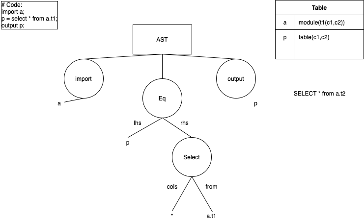

## TOC

- [TOC](#toc)
- [Running HSQLT](#running-hsqlt)
  - [Working with the CLI tool](#working-with-the-cli-tool)
  - [NPM scripts](#npm-scripts)
- [How HSQLT works](#how-hsqlt-works)
  - [What is an AST?](#what-is-an-ast)
- [Testing and Debugging](#testing-and-debugging)
  - [Mocha](#mocha)
  - [Debugging grammar](#debugging-grammar)
  - [Debugging the program](#debugging-the-program)
- [Dev notes](#dev-notes)
  - [Goals](#goals)
- [Dependencies](#dependencies)
  - [Non-NPM dependencies:](#non-npm-dependencies)
  - [NPM based:](#npm-based)
- [Dependency notes](#dependency-notes)
  - [ANTLR](#antlr)
  - [String Template](#string-template)
  - [Typedoc](#typedoc)
  - [Madge](#madge)
  - [Notes with the repository](#notes-with-the-repository)
- [Other References](#other-references)


## Running HSQLT
### Working with the CLI tool

What's needed beforehand: `NodeJS`~v14,`Java`>v8.
(Hint: https://nodejs.org/ and https://www.java.com/ should be good sources to get them)

1. Install the project dependencies
    ```sh
    npm install
    ```
2. As this project is based on typescript, it can be run in various ways. (Tip: Use the first if it looks simpler)
    - Run the typescript project directly
        ```sh
        ts-node src/index.ts # This is the program
        ```
    - Build to JS
        ```bash
        npm run build # A tsc command that compiles the code into build/
        node build/index.js # Run the build js file
        ```
    - Compile to bytecode and package to executable (This uses the code built to JS)
        ```bash
        npm run pkg # A pkg command that compiles and packages your code into dist/
        ./dist/hsqlt-linux # pick your corresponding executable
        ```

TIP: index.js/index.ts is automatically inferred if the directory name is specified, so they may be ommitted.
i.e. `node build` is the same as `node build/index.js`


### NPM scripts

NPM scripts are defined here to help you do some quick actions on this repository.
Its easier to remember the script name, rather than the whole command required to execute it.

Usage: `npm run <script-name>`

| Script Name    | Explanation                                  | Default Output location |
| -------------- | -------------------------------------------- | ----------------------- |
| check          | Checks source code for errors                | -                       |
| check-circular | Checks source code for cyclic dependencies   | -                       |
| build          | Build the project into JS                    | `build/`                |
| build-dev      | Build the project & tests into JS            | `build/`                |
| test           | Runs all tests (TS)                          | -                       |
| regen          | Regenerate ANTLR grammar                     | `src/misc/grammar/`     |
| doc            | Generate TypeDoc documentation               | `docs/`                 |
| pkg            | Compile and package application              | `dist/`                 |
| cov            | Code Coverage                                | -                       |
| clean          | Remove build artifacts (`build`,`doc`,`pkg`) | -                       |


## How HSQLT works


HSQLT is a compiler that converts HSQL to ECL. While the premise sounds simple, there are quite a few parts (as it is a compiler). The meat of the processing happens in the line of squares above:
1. Lexical Analysis
2. Syntactic Analysis/Parsing 
3. Semantic Analysis/AST Generation - Peek at the [AST Generator](../src/conv/syntax/ASTGenerator.ts)
4. Codegen/ ECL Generation - Peek at [ECL Generator](../src/conv/ast/ECLGenerator.ts)

Out of these 4 segments, the first two are generated automatically by ANTLR, from [the HSQL.g4 grammar](../grammar/HSQL.g4). These generated files are stored in the './src/misc/grammar'. Refer to the ANTLR documentation for how to use these.
The rest of the program wraps around this pipeline, and provides things such as:
1. Output management - How and where to write files ([OutputManager](../src/managers/OutputManagers.ts))
2. Task management - Orchestrate the process of compilation ([TaskManager](../src/managers/TaskManager.ts))
3. Variable Table Management - Performs a job similar to that of a 'Symbol Table' in standard compiler literature. The main difference here, is that these are kept only to track the types, and are created during the semantic analysis (AST Generation) phase.
4. Input management - Figure out and provide files and their contents during compilation ([FSManager](../src/managers/FSManager.ts))
5. ECL(/cc) integration - Gets information and uses the Ecl client tools ([ECLClientToolsInterfacing](../src/misc/eclcc/ECLClientToolsInterfacing.ts))

### What is an AST?

**A**bstract **S**yntax **T**ree.



Above is a simplified graphical representation of an AST Tree.
ANTLR has a lot of issues with tree rewriting, and the easier way is to maintain a custom AST that is a lot more simpler and compact than the parse tree.

## Testing and Debugging

General tests are stored under `src/test`
Module-specific file are present side-by-side as `*.spec.ts`
Tests can be called with the `test` script.
### Mocha

Mocha provides `npm run test`. Use it if you want to. Additionally, some extensions are recommended to be installed (which will show up in VSCode if this repository is opened as a folder), which allow VSCode to work well with Mocha and provide a UI for testing.
### Debugging grammar

The repository has preconfigured extension recommendations for usage.
Open the grammar file and press F5 (/the debug key shortcut/go to the debug menu)
This will use `input.hsql` and should show:

-   Parse/Lexing errors
-   The parse tree (Note that semantic actions/predicates **are ignored here**)

You can set breakpoints on the grammar to see how the string gets processed.
### Debugging the program

The best way to test the program, is with VSCode's `Javascript Debug Terminal`. Here, use `npx ts-node` to work with these features.

Opening a JS Debug Terminal (`input.hsql` is usually a great candidate) and execute one of the following:

```sh
npx ts-node src check input.hsql
npx ts-node src make input.hsql
npx ts-node src run input.hsql
```

## Dev notes

### Goals

HSQL
- [ ] SQL 92 syntax support
- [X] Function and Modular support
- [ ] Transparent Medley support
- [X] VS Code support
- [X] Full ML support


## Dependencies

### Non-NPM dependencies:

- Java(>8) - Required for ANTLR

### NPM based:

Dependencies:

- ts-node - TS Runtime wrapping for NodeJS
- antlr4ts - ANTLR tool
- @types/node - Types for Node.JS environment
- yargs - provides optstring parsing for Node.JS application
- string-template - Provides string templates for usage

devDependencies(Dependencies that are used during development):

- typedoc - Generate project documentation from source comments
- typescript - Runtime
- nodemon - Reruns the project if source code is changed (Useful during development)
- mocha - Testing framework
- chai - Assertion library
- antlr4ts-cli - Provides a CLI to work with the ANTLR tool
- pkg - Compile to bytecode and package into executable
- madge - Circular dependency detection 

## Dependency notes
### ANTLR

The grammar is not language independent; actions are used where data can be more easily obtained from the parsing stage. It can be refactored away if required, but it shouldn't be a huge concern. 

Note: The local declarations can be reworked to suit the target language, as most languages have a similar methodology for assignments.

### String Template

`string-template` is an important section of HSQLT, it provides a way of using string-based templating.
Note that it exposes a formatting function and also a compile function. The compile function should be used for cases of format strings which would be used often in a program.

### Typedoc

Typedoc is a documentation generator and most types requiring explanation have been documented.
To generate the documentation:

```sh
npm run doc
```

This will place the documentation under `docs/`.
Note that the result will be a html project. The easiest way to view it, is to use a document server like `serve` that creates a local webserver for you to use:

```sh
npx serve docs/
```
### Madge

The JS emit is based on CommonJS, and care has to be taken to *not* include circular dependencies. Due to how includes are done at runtime in CommonJS modules, certain imports may not work correctly (Although it is deterministic and you can certainly get it to work if circular dependencies are required). Hence, the best way to deal with circular dependencies, is to not have them at all. 
```sh
npm run check-circular
```
This should give a good idea as to where circular dependencies are present.

### Notes with the repository

All assumptions made can be tracked with comments having `FIXME` and `FUTURE` and may be expanded on.

## Other References
- [SQL 92 reference](http://www.contrib.andrew.cmu.edu/~shadow/sql/sql1992.txt)
- [SQLite Grammar](https://github.com/antlr/grammars-v4/blob/master/sql/sqlite/SQLiteParser.g4)
