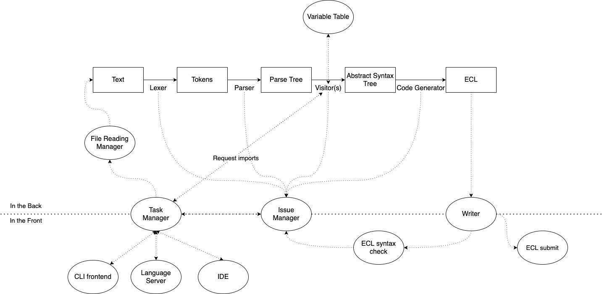

## Dependencies

### Non-NPM dependencies:

-   Java(>8) - Required for ANTLR

### NPM based:

Dependencies:

-   ts-node - TS Runtime wrapping for NodeJS
-   antlr4ts - ANTLR tool
-   @types/node - Types for Node.JS environment
-   yargs - provides optstring parsing for Node.JS application
-   string-template - Provides string templates for usage

devDependencies(Dependencies that are used during development):

-   typedoc - Generate project documentation from source comments
-   typescript - Runtime
-   nodemon - Reruns the project if source code is changed (Useful during development)
-   mocha - Testing framework
-   chai - Assertion library
-   antlr4ts-cli - Provides a CLI to work with the ANTLR tool
-   pkg - Compile to bytecode and package into executable


### ANTLR

The grammar is ~~action-free~~ mostly action-free; actions are used where data can be more easily obtained from the parsing stage. It can be refactored away if required, but it shouldn't be a huge concern.
### Typedoc

Typedoc is a documentation generator and most types requiring explanation have been documented.
To generate the documentation:

```sh
npm run doc
```

This will place the documentation under `docs/`.
Note that the result will be a html project. The easiest way to view it, is to use a document server like `serve` that creates a local webserver for you to use:

```sh
npx serve docs/
```
### Madge

The JS emit is based on CommonJS, and care has to be taken to *not* include circular dependencies. Due to how includes are done at runtime in CommonJS modules, certain imports may not work correctly (Although it is deterministic and you can certainly get it to work if circular dependencies are required). Hence, the best way to deal with circular dependencies, is to not have them at all. 
```sh
npm run check-circular
```
This should give a good idea as to where circular dependencies are present.

## Basic syntaxes

### Starting with work

The current objective is to ~~get code generation working~~ add essential HSQL features.
After that, all assumptions made (can be tracked with comments having `FIXME` and `FUTURE` ) should be worked on.


### Todo list
- [X] ~~Typedef~~

### Goals

HSQL
- [ ] SQL 92 syntax support
- [ ] Function and Modular support
- [ ] Transparent Medley support
- [ ] VS Code support
- [ ] Full ML support

## [Program UI](./programui.md)

## [Scratchpad](./scratchpad.md)

## Current architecture


